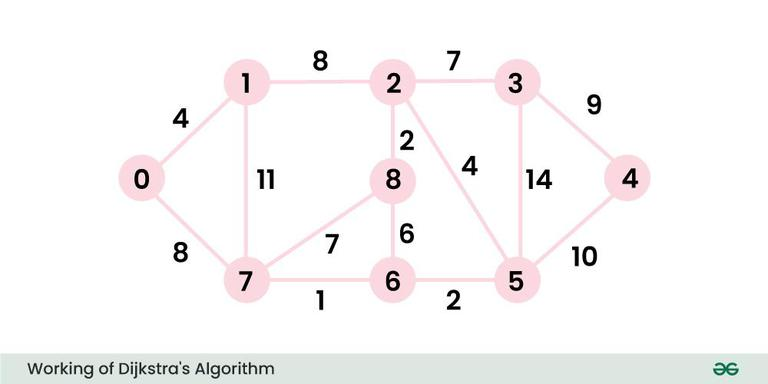

---
layout:
  title:
    visible: true
  description:
    visible: true
  tableOfContents:
    visible: true
  outline:
    visible: true
  pagination:
    visible: true
---

# 💎 Streamlit Application #1

## Goal

We are going to translate our Python calculator that runs on the terminal to a simple web application.


What is a web application?

A web application is a software program that runs in a web browser. Unlike traditional software that you need to install on your computer, you access web applications over the internet by typing a URL or clicking a link. Examples include email services like Gmail, online banking, and social media platforms like Facebook. They allow users to perform tasks and interact with content through a user-friendly interface on the web.


### What is [Streamlit](https://streamlit.io/)?

<figure><figcaption></figcaption></figure>

Streamlit is an open-source Python library that simplifies the process of creating and sharing custom web applications for data science and machine learning projects.&#x20;

It allows developers to quickly build interactive and visually appealing applications using simple Python scripts without requiring any web development experience. Streamlit provides an intuitive API for adding widgets, charts, and other UI elements, making it easy to visualize data and model outputs. Applications built with Streamlit can be deployed and shared with others effortlessly. Its real-time updating feature enhances the interactivity and responsiveness of the apps.

### Getting Started

_insert installation guide and such..._

### How our App Looks

<figure><figcaption><p>Screenshot of the web app calculating 6 x 9</p></figcaption></figure>

### Python Code using Streamlit

```python
# Streamlit Python Application

# Dependency Imports
import streamlit as st

# Application
st.title("Calculator App")

# Select an operation
choice = st.selectbox(
    label="Choose an operation.",
    options=["Add", "Subtract", "Multiply", "Divide"],
    index=None,
    placeholder="Choose one of the options"
)

# Provide two operands for our operations
# Only if the user has selected an operation
# we could have also wrote: if choice is not None:
if choice:
    num1 = st.number_input(
        label="Enter a value.",
        value=0.0,
        key="operand1"
    )
    
    num2 = st.number_input(
        label="Enter a value.",
        value=0.0,
        key="operand2"
    )

    result = 0 # initialize our answer container
    
    # Displaying our answer
    st.write("The calculation:")

    if choice == "Add":
        result = num1 + num2
        st.write(f"{num1} + {num2} = {result}")
    elif choice == "Subtract":
        result = num1 - num2
        st.write(f"{num1} - {num2} = {result}")
    elif choice == "Multiply":
        result = num1 * num2
        st.write(f"{num1} * {num2} = {result}")
    elif choice == "Divide":
        if num2 == 0:
            st.write("Invalid denominator, cannot divide by zero.")
        else:
            result = num1 / num2
            st.write(f"{num1} / {num2} = {result}")
```
