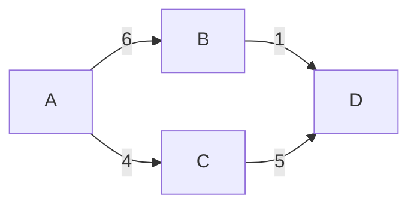

# Greedy Algorithm

**Greedy Algorithms** are designed to make the best possible decision in the situation provided.

Examine the diagram where each node has a weighted vertex.

* It costs 6 units to travel from A to B
* It costs 4 units to travel from A to C
* It costs 1 unit to travel from B to D
* It costs 5 units to travel from C to D

_**To minimize the number of unit spent to travel from A to D would be going from A to B to D.**_

`However, the greedy algorithm will choose a path of A to C to D.`

* This occurs because when we decided where to go from A, destination C is the cheaper route
* The greedy algorithm will **always choose the most optimal option at its given moment.**

## Why the hell would I even use a greedy algorithm?

**`Greedy algorithms are very fast.`**&#x20;

They are faster than most algorithms solved in different paradigms.

Also, when a greedy algorithm is designed very well, it will produce **the most efficient/optimal/correct** answer as well.
